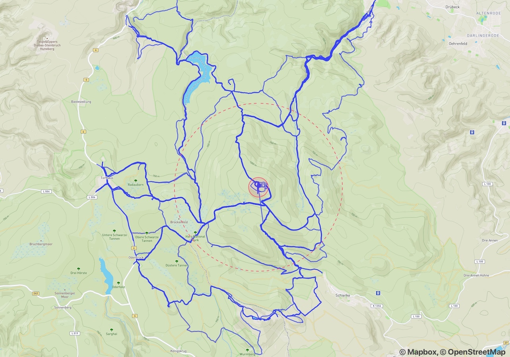

# brocken

A quick experiment to figure out how many times I've summited [a small local mountain](https://en.wikipedia.org/wiki/Brocken) given my [Strava](https://strava.com) activities. [More details here](http://ahammer.me/2018/06/counting-mountain-summits-with-strava/).

## Idea

Given a bunch of GPS activities and a polygon defining the area of the summit, find all activities that contain successfull summits.

Special consideration is given to:

- Activities where ascent and descent were recorded separately.
- Multiple summits within a single activity are counted individually provided a minimum distance between subsequent summits is covered.

## Results

    Total number of activities: 777

    Total number of summits: 60

    Activities with summits: 57 (48 runs, 9 hikes)
        Shortest: 8 km, longest: 59 km, mean: 21 km
        Lowest elevation gain: 363 m, highest: 1881 m, mean: 719 m

(June 2018)

## Usage

You need `node` with `npm`.

**Install dependencies**:

    npm install

**Download from Strava and analyze**:

    npm start

**Only download**:

    npm run strava

**Only analyze**:

    npm run analyze

**Analyze included example file**:

    npm run examples

## Strava Setup

 There is a script to download all your Strava activities. Alternatively, you can skip Strava and supply any other GeoJSON file containing a collection of line strings, e.g. the included `data/examples.geojson`.

### Token

For Strava, you need an authorization token. You can get a default public token by creating a Strava API app ([follow this](https://yizeng.me/2017/01/11/get-a-strava-api-access-token-with-write-permission/)). To be able to access your private activities, you need a private token ([follow this](https://yizeng.me/2017/01/11/get-a-strava-api-access-token-with-write-permission/)).

Put the token in a file called `stravatoken`.

### Rate Limiting

The Strava API is rate-limited to 600 requests every 15 minutes. If you have more activities than that, you may need to run the script in batches to download them all.

## License

MIT